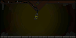
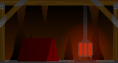
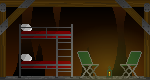
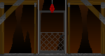
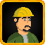

# DIG OUT

  

*... It was a huge mine, with a museum above it. It was a difficult day for many workers and visitors. No one expected it, and yet... the mine collapsed, taking everyone with it. The question is whether they can dig out of this mess...*

## Game Description
Can you rescue the survivors from the collapsed mine? The survivors are counting on you. Can you dig them out and manage their work to get them to the surface?

Build buildings, distribute food rations, dig up new rooms, and find a way out of the building. This is what DigOut is all about.
## Gameplay Details
The game begins at the lowest part of the mine, with one survivor and optional starting resources. As the game progresses, the player manages an increasing number of survivors, assigning them tasks and maintaining resources.

The game board is divided into 10 levels, each containing 10 rooms. The player starts at the lowest level, with the goal of reaching the exit at the top level of the mine.

  

### Core Gameplay Elements
- **Exploring Spaces**:
    - Survivors can excavate adjacent tiles, uncovering resources, other survivors, or items.
    - Excavating already-discovered tiles is not allowed.
    - Hard rocks on higher levels require special tools, such as a pickaxe.

- **Constructing Infrastructure**:
    - Players can commission the construction of structures, such as:
        - **Elevator** – allows movement between levels.
        - **Restroom** – a resting area for survivors.
        - **Kitchen** – trains cooks and prepares food.
        - **Air Pump** – increases the maximum number of survivors on a level.
        - **Power Plant** – provides energy for Air Pumps and other buildings.

- **Managing Survivors**:
    - Each survivor has 4 energy points, consumed during tasks.
    - Survivors with zero energy at the start of a round die.
    - Survivors can be trained in specialized buildings to change their professions.

- **Managing Resources**:
    - Available resources: Building Material, Food, Tools.
    - Special items, such as oxygen masks, help survivors survive difficult conditions.

### Survivor Professions
1. **Worker** – excavates spaces and constructs buildings.
2. **Cook** – prepares food.
3. **Technician** – crafts tools in the Workshop.
4. **Untrained** – no specialization; can be trained in appropriate buildings.

  

### Game Objective
The goal is to manage survivors and resources effectively to evacuate as many people as possible from the mine. Points are awarded based on the number of survivors saved and resources gathered.

## Technical Requirements
- **Java**: Version 18 or higher.
- **Screen Resolution**: Full HD (1920x1080) with a 16:9 or 16:10 aspect ratio.
- **Operating System**: Windows 10 or newer (likely works on older versions as well).  

