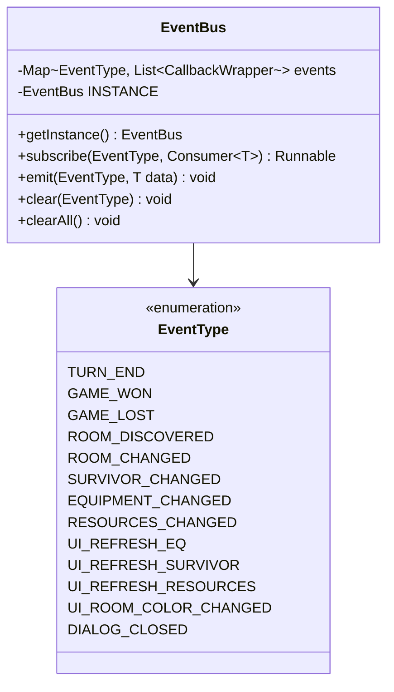

# EventBus Integration Plan for DigOut

## Executive Summary

This document outlines a comprehensive plan to integrate the EventBus pattern into the DigOut codebase to decouple business logic from UI, eliminate static state abuse, and improve testability.

---

## Current State Analysis

### Existing EventBus Implementation

The current EventBus implementation is a **singleton with type-safe event handling**:

```java
// EventBus.java
public class EventBus {
    private static class CallbackWrapper<T> {
        private final Consumer<T> callback;
        void accept(Object data) { callback.accept((T) data); }
    }

    private static final EventBus INSTANCE = new EventBus();

    public static EventBus getInstance() { return INSTANCE; }

    private final Map<EventType, List<CallbackWrapper<?>>> events = new HashMap<>();

    public <T> Runnable subscribe(EventType event, Consumer<T> callback) {...}
    public <T> void emit(EventType event, T data) {...}
    public void clear(EventType event) {...}
    public void clearAll() {...}
}

// EventType.java
public enum EventType {
    TURN_END
}
```

**Key Features:**

1. **Singleton Pattern** - Global access via `EventBus.getInstance()`
2. **Type-safe callbacks** - Uses `Consumer<T>` for typed event data
3. **Payload support** - Events can carry typed data via `emit(EventType, T data)`
4. **Unsubscribe support** - `subscribe()` returns a `Runnable` to unsubscribe
5. **Concurrent modification safety** - Creates callback copy before iteration

**Limitations:**

1. Single EventType (`TURN_END`) is insufficient for the codebase needs
2. Singleton pattern may complicate testing and save/load scenarios

### Key Coupling Hotspots to Address

| Source                                                                                      | Target       | Current Mechanism | Calls                                          |
| ------------------------------------------------------------------------------------------- | ------------ | ----------------- | ---------------------------------------------- |
| [`RoomManager`](core/src/main/java/com/kraisu/digout/managers/RoomManager.java:287)         | `GameScreen` | Static method     | `GameScreen.setGameWin(true)`                  |
| [`RoomManager`](core/src/main/java/com/kraisu/digout/managers/RoomManager.java:173-234)     | `GameScreen` | Static method     | `GameScreen.colorTileAtCoordinate()` (9 calls) |
| [`SurvivorManager`](core/src/main/java/com/kraisu/digout/managers/SurvivorManager.java:453) | `GameScreen` | Static method     | `GameScreen.setGameLose(true)`                 |
| [`DiaryManager`](core/src/main/java/com/kraisu/digout/managers/DiaryManager.java:69)        | `GameScreen` | Static method     | `GameScreen.setXWasClicked(true)`              |
| [`uiHelps`](core/src/main/java/com/kraisu/digout/scenes/uiHelps.java:195)                   | `GameScreen` | Static setters    | `setNeedsRefreshAfterAddEQ(true)`              |
| [`uiHelps`](core/src/main/java/com/kraisu/digout/scenes/uiHelps.java:1366)                  | `GameScreen` | Static setters    | `setNeedsRefreshAfterAddTask(true)`            |

### Refresh Flag Pattern (Anti-Pattern)

```java
// GameScreen.java:57-60
private static boolean needsRefreshAfterAddEQ = false;
private static boolean needsRefreshAfterAddTask = false;
private static boolean needsRefreshAfterEndRound = false;

// Checked in render loop - GameScreen.java:448-498
private void checkNeedsRefresh() {
    if (needsRefreshAfterAddEQ) {
        needsRefreshAfterAddEQ = false;
        refreshEqInfoTable();
        refreshSurvivorBar();
        // ...
    }
    // Similar for other flags
}
```

---

## Proposed EventBus Architecture

### Enhanced Event Model



### Event Categories

#### Domain Events - Emitted by Managers

| Event               | Emitter          | Payload Type      | Subscribers |
| ------------------- | ---------------- | ----------------- | ----------- |
| `GAME_WON`          | RoomManager      | `Void` (null)     | GameScreen  |
| `GAME_LOST`         | SurvivorManager  | `Void` (null)     | GameScreen  |
| `TURN_ENDED`        | GameScreen       | `Integer`         | Multiple    |
| `ROOM_DISCOVERED`   | RoomManager      | `RoomPayload`     | GameScreen  |
| `ROOM_CHANGED`      | RoomManager      | `Coordinate`      | GameScreen  |
| `SURVIVOR_CHANGED`  | SurvivorManager  | `Survivor`        | GameScreen  |
| `EQUIPMENT_CHANGED` | EquipmentManager | `Survivor`        | GameScreen  |
| `RESOURCES_CHANGED` | ResourceManager  | `ResourcePayload` | GameScreen  |

#### UI Events - Emitted by UI, Consumed by UI

| Event                   | Emitter      | Payload Type       | Subscribers |
| ----------------------- | ------------ | ------------------ | ----------- |
| `UI_REFRESH_EQ`         | uiHelps      | `Survivor`         | GameScreen  |
| `UI_REFRESH_SURVIVOR`   | uiHelps      | `Survivor`         | GameScreen  |
| `UI_REFRESH_RESOURCES`  | uiHelps      | `Void` (null)      | GameScreen  |
| `UI_ROOM_COLOR_CHANGED` | RoomManager  | `RoomColorPayload` | GameScreen  |
| `DIALOG_CLOSED`         | DiaryManager | `Void` (null)      | GameScreen  |

---

## Integration Points

### Phase 1: Game State Events - Critical

#### 1.1 Replace `GameScreen.setGameWin()` / `GameScreen.setGameLose()`

**Before - RoomManager.java:285-288**

```java
public void checkWinGame(){
    if(getExitRoom().getBuildUp().equals(Constants.Buildings.ELEVATOR))
        GameScreen.setGameWin(true);  // UI coupling!
}
```

**After**

```java
// RoomManager.java
public void checkWinGame(){
    if(getExitRoom().getBuildUp().equals(Constants.Buildings.ELEVATOR))
        EventBus.getInstance().emit(EventType.GAME_WON, null);
}

// GameScreen.java - in show() or constructor
EventBus.getInstance().subscribe(EventType.GAME_WON, (Void v) -> {
    endRoundButton.setDisabled(true);
    displayInfoBox(stage, "Yeyy you Win!...", Mark.INFO, () -> {
        ((Game) Gdx.app.getApplicationListener()).setScreen(
            new SplashToNextScreen(Constants.WhereSplashGo.WIN, myGame));
    });
});
```

**Before - SurvivorManager.java:451-454**

```java
public void checkLoseGame(){
    if(survivors.isEmpty())
        GameScreen.setGameLose(true);  // UI coupling!
}
```

**After**

```java
// SurvivorManager.java
public void checkLoseGame(){
    if(survivors.isEmpty())
        EventBus.getInstance().emit(EventType.GAME_LOST, null);
}

// GameScreen.java
EventBus.getInstance().subscribe(EventType.GAME_LOST, (Void v) -> {
    endRoundButton.setDisabled(true);
    displayInfoBox(stage, "You lost...", Mark.ERROR, () -> {
        ((Game) Gdx.app.getApplicationListener()).setScreen(
            new SplashToNextScreen(Constants.WhereSplashGo.LOSE, myGame));
    });
});
```

#### 1.2 Replace `GameScreen.colorTileAtCoordinate()` Calls

**Before - RoomManager.java:172-174**

```java
roomU = ableToDiscoveredRoom(tempUp, myGame);
GameScreen.colorTileAtCoordinate(tempUp, roomU, name + "_U.0");  // UI coupling!
roomU.setActualPicture(name + "_U.0");
```

**After**

```java
// RoomManager.java
roomU = ableToDiscoveredRoom(tempUp, myGame);
EventBus.getInstance().emit(EventType.ROOM_COLOR_CHANGED,
    new RoomColorPayload(tempUp, roomU, name + "_U.0"));
roomU.setActualPicture(name + "_U.0");

// GameScreen.java
EventBus.getInstance().subscribe(EventType.ROOM_COLOR_CHANGED, (RoomColorPayload p) -> {
    colorTileAtCoordinate(p.coordinate, p.room, p.pictureName);
});
```

### Phase 2: Refresh Flag Events - High Priority

#### 2.1 Replace `needsRefreshAfterAddEQ`

**Before - uiHelps.java:194-196**

```java
getAddEqAndTaskTable().clear();
setNeedsRefreshAfterAddEQ(true);  // Static flag!
setTempSurvivor(survivor);
```

**After**

```java
// uiHelps.java
getAddEqAndTaskTable().clear();
EventBus.getInstance().emit(EventType.EQUIPMENT_CHANGED, survivor);

// GameScreen.java
EventBus.getInstance().subscribe(EventType.EQUIPMENT_CHANGED, (Survivor survivor) -> {
    refreshEqInfoTable();
    refreshSurvivorBar();
    refreshResourceBar();
    survivorInfoTable.clear();
    survivorInfoTable.add(showSurvivorInfo(survivor));
    survivorsTable.setTouchable(Touchable.enabled);
});
```

#### 2.2 Replace `needsRefreshAfterAddTask`

**Before - uiHelps.java:1363-1367**

```java
survivor.setTask(new Task(coordinate, task, costOfTask(task), null));
reloadResources(survivor, myGame);
setNeedsRefreshAfterAddTask(true);  // Static flag!
setTempSurvivor(survivor);
```

**After**

```java
// uiHelps.java
survivor.setTask(new Task(coordinate, task, costOfTask(task), null));
reloadResources(survivor, myGame);
EventBus.getInstance().emit(EventType.SURVIVOR_TASK_CHANGED, survivor);

// GameScreen.java
EventBus.getInstance().subscribe(EventType.SURVIVOR_TASK_CHANGED, (Survivor survivor) -> {
    updateColorRoom();
    refreshSurvivorBar();
    refreshResourceBar();
    survivorInfoTable.clear();
    survivorInfoTable.add(showSurvivorInfo(survivor));
    survivorsTable.setTouchable(Touchable.enabled);
    checkAbleToEndRound(myGame, endRoundTooltip, endRoundButton);
});
```

#### 2.3 Replace `needsRefreshAfterEndRound`

**Before - GameScreen.java:474-498**

```java
if(needsRefreshAfterEndRound){
    needsRefreshAfterEndRound = false;
    isXWasClicked = false;
    myGame.getSurvivorManager().allSurvivorGotReceivedStuff();
    // ... 15+ operations
}
```

**After**

```java
// EndRoundButton click handler
EventBus.getInstance().emit(EventType.TURN_END, myGame.getRound());

// GameScreen.java - subscriber (already partially implemented)
EventBus.getInstance().subscribe(EventType.TURN_END, (Integer round) -> {
    isXWasClicked = false;
    myGame.getSurvivorManager().allSurvivorGotReceivedStuff();
    myGame.getResourceManager().consumeAllocatedResources();
    uiHelps1.doTheTasks(myGame);
    // ... rest of operations
});

// This also allows OTHER systems to react to turn end
// For example, achievements, statistics, etc.
```

### Phase 3: DiaryManager Decoupling

**Before - DiaryManager.java:68-70**

```java
table.remove();
GameScreen.setXWasClicked(true);  // UI coupling!
```

**After**

```java
// DiaryManager.java
table.remove();
EventBus.getInstance().emit(EventType.DIALOG_CLOSED, null);

// GameScreen.java
EventBus.getInstance().subscribe(EventType.DIALOG_CLOSED, (Void v) -> {
    isXWasClicked = true;
});
```

---

## Event Payload Classes

For complex events that need to carry multiple values, create payload classes in the `EventBus` package:

```java
// Room color change payload
package com.kraisu.digout.EventBus;

public class RoomColorPayload {
    public final Coordinate coordinate;
    public final Room room;
    public final String pictureName;

    public RoomColorPayload(Coordinate coordinate, Room room, String pictureName) {
        this.coordinate = coordinate;
        this.room = room;
        this.pictureName = pictureName;
    }
}

// Resource change payload
package com.kraisu.digout.EventBus;

public class ResourcePayload {
    public final Constants.Resources resourceType;
    public final int amount;
    public final int previousAmount;

    public ResourcePayload(Constants.Resources resourceType, int amount, int previousAmount) {
        this.resourceType = resourceType;
        this.amount = amount;
        this.previousAmount = previousAmount;
    }
}
```

**Note:** For simple payloads (single object), you can pass the object directly without a wrapper class:

- `Survivor` events → pass `Survivor` directly
- `Coordinate` events → pass `Coordinate` directly
- Events with no data → pass `null`

---

## Implementation Phases

### Phase 1: Foundation - Must Do First

1. **Expand EventType enum**
   - Add all event types listed above to [`EventType.java`](core/src/main/java/com/kraisu/digout/EventBus/EventType.java)

2. **Create payload classes (as needed)**
   - `RoomColorPayload` (for room color changes)
   - `ResourcePayload` (for resource changes)
   - Other simple payloads can use existing classes directly

### Phase 2: Critical Coupling Removal

1. **RoomManager decoupling**
   - Replace `GameScreen.setGameWin()` with event
   - Replace `GameScreen.colorTileAtCoordinate()` with events

2. **SurvivorManager decoupling**
   - Replace `GameScreen.setGameLose()` with event

### Phase 3: Refresh Flag Removal

1. **Replace `needsRefreshAfterAddEQ`**
2. **Replace `needsRefreshAfterAddTask`**
3. **Replace `needsRefreshAfterEndRound`**
4. **Delete static flag fields from GameScreen**

### Phase 4: Remaining Cleanup

1. **DiaryManager decoupling**
2. **Remove static imports in uiHelps**
3. **Final verification and cleanup**

---

## Usage Examples

### Subscribing to Events

```java
// Subscribe with typed callback
Runnable unsubscribe = EventBus.getInstance().subscribe(EventType.GAME_WON, (Void v) -> {
    // Handle game won
});

// Subscribe with payload
EventBus.getInstance().subscribe(EventType.SURVIVOR_CHANGED, (Survivor s) -> {
    updateSurvivorUI(s);
});

// Later: unsubscribe if needed
unsubscribe.run();
```

### Emitting Events

```java
// Emit event with no data
EventBus.getInstance().emit(EventType.GAME_WON, null);

// Emit event with data
EventBus.getInstance().emit(EventType.SURVIVOR_CHANGED, survivor);

// Emit event with complex payload
EventBus.getInstance().emit(EventType.ROOM_COLOR_CHANGED,
    new RoomColorPayload(coordinate, room, "picture_name"));
```

### Cleanup

```java
// Clear all subscriptions for a specific event
EventBus.getInstance().clear(EventType.GAME_WON);

// Clear all subscriptions (useful when loading a new game)
EventBus.getInstance().clearAll();
```

---

## Save/Load Considerations

Since EventBus is a singleton, save/load operations need special handling:

```java
// When loading a saved game
public void loadGame(SaveData save) {
    // Clear any existing subscriptions from previous game
    EventBus.getInstance().clearAll();

    // Load game state
    myGame = save.getMyGame();

    // Rebuild UI and re-subscribe to events
    rebuildUI();
    setupEventSubscriptions();
}
```

---

## Migration Strategy

### Step-by-Step Approach

1. **Add new EventTypes to the enum**
   - Add all needed event types first

2. **Add event emission alongside existing static calls**
   - Don't remove static methods yet
   - Emit events AND call static methods
   - Verify events work correctly

3. **Add subscribers in GameScreen**
   - Convert one refresh handler at a time
   - Test thoroughly

4. **Remove static calls**
   - Once events are verified
   - Remove static setters/getters

5. **Delete static fields**
   - Final cleanup

### Testing Strategy

Since there are no unit tests, verification will be manual:

1. **Game Win Condition**
   - Build elevator on exit room
   - Verify win dialog appears

2. **Game Lose Condition**
   - Kill all survivors
   - Verify lose dialog appears

3. **Equipment Assignment**
   - Assign equipment to survivor
   - Verify UI refreshes

4. **Task Assignment**
   - Assign task to survivor
   - Verify UI refreshes

5. **End Turn**
   - End turn multiple times
   - Verify all operations execute

---

## Benefits of This Refactoring

| Before                            | After                                |
| --------------------------------- | ------------------------------------ |
| Managers import GameScreen        | Managers only import EventBus        |
| Static state in GameScreen        | Instance-based state                 |
| Hidden dependencies               | Explicit event subscriptions         |
| Cannot test managers in isolation | Managers testable with mock EventBus |
| Refresh flags checked every frame | Event-driven updates                 |
| Tight coupling                    | Loose coupling via events            |

---

## Open Questions

1. **Thread Safety**: Should EventBus be thread-safe for potential future async operations?
2. **Event Priority**: Do we need priority ordering for event handlers?
3. **Event History**: Should we keep event history for debugging?
4. **Singleton vs Instance**: Should we keep singleton or use instance-per-game-session?

---

## Estimated Scope

| Phase   | Files Modified                           | Complexity  |
| ------- | ---------------------------------------- | ----------- |
| Phase 1 | EventType.java, payload classes          | Low         |
| Phase 2 | RoomManager, SurvivorManager, GameScreen | Medium      |
| Phase 3 | uiHelps, GameScreen                      | Medium-High |
| Phase 4 | DiaryManager, cleanup                    | Low         |

Total estimated files to modify: ~8-10 files
